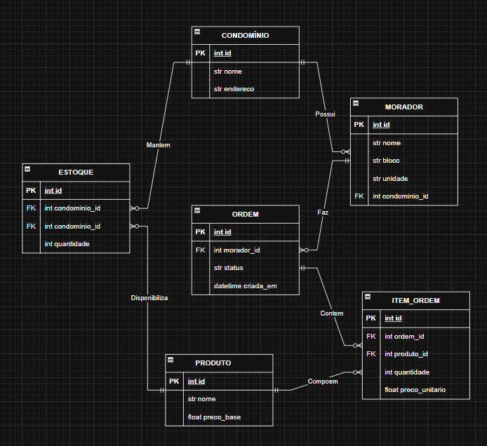

# Order API - Metodologia de Desenvolvimento E-Commerce

Esse projeto foi desenvolvido aplicando um método de Pair Programming. A IA foi utilizada estritamente como uma tutora de engenharia para validar, desafiar e garantir que o código seguisse rigorosamente os padrões de [SOLID, TDD e Design Patterns abordados na literatura base](https://drive.google.com/drive/folders/1cNVdJuO5ZqYwrfS75X0OIpM8RcLFeMcq?usp=sharing).

## Objetivo
O objetivo desse projeto é criar um e-commerce para empresas de mini mercado poderem ter um sistema backend aplicável em qualquer cenário base, podendo fazer implementações a desejar.

## Método
Como o projeto visa colocar em prática minha leitura e conhecimento sobre a implementação de projetos backend em formato de teste, irei começar implementando os testes, validando os modelos, e por fim as rotas.

## DER:

